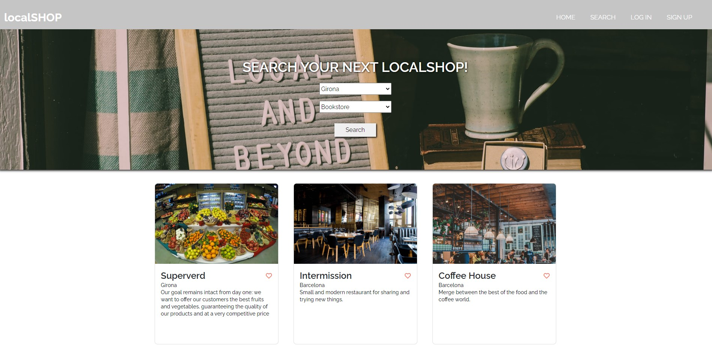
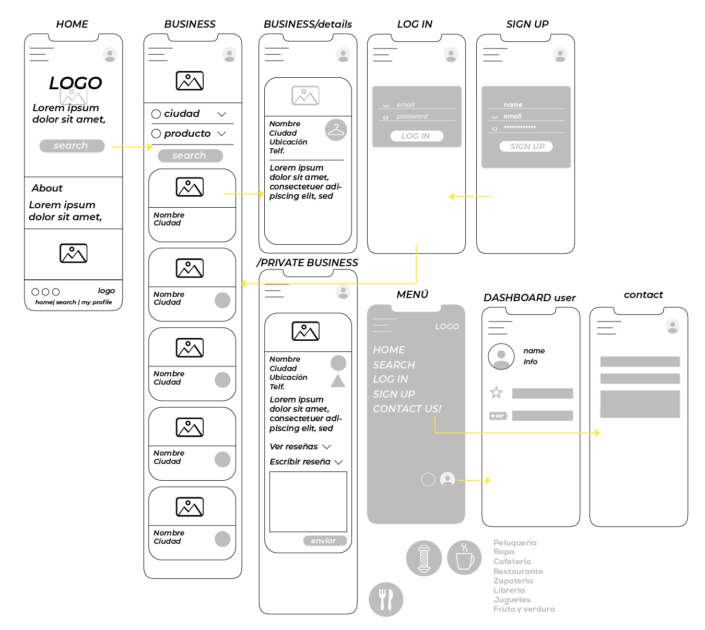

# localSHOP://

<br>




<br>

## Description

Search platform for small local business where you can get information about them and their products. Also you can get in touch with and save them as your favourite.

Reviews gives you the opportunity of give your two cents on what you think of the place, the people and service, or simply a general thought on the matter.

As a local business, you got the chance for register as one and share what and where you do what you do, your social contact and view what others enjoy of what you offer.

<br>

## User Stories

- **404** - As a user I want to see a nice 404 page when I go to a page that doesn’t exist so that I know it was my fault.
- **500** - As a user I want to see a nice error page when the super team screws it up so that I know that is not my fault.
- **homepage** - As a user I want to be able to access the homepage, see what the page is about and access to other areas of it.
- **sign up** - As a user I want to sign up on the web page so that I can personalize my profile and save information for the future.
- **login** - As a user I want to be able to log in on the web page so that I can get back to my account.
- **logout** - As a user I want to be able to log out from the web page so that I can make sure no one will access my account.
- **profile page** - As a user I want to see the list of my favorite and delete them, and edit my profile as well.
- **business** - As a user I want to see the list of business filter by my preferences.
- **business details** - As a user I want to see more details of each business, be able to call them and visit their website and save it as favorites.

<br>

## Server Routes (Back-end):

| **Method** | **Route**                    | **Description**                                              | Request - Body                                            |
| ---------- | ---------------------------- | ------------------------------------------------------------ | --------------------------------------------------------- |
| `GET`      | `/`                          | Main page route. Renders home `index` view.                  |                                                           |
| `GET`      | `/login`                     | Renders `login` form view.                                   |                                                           |
| `POST`     | `/login`                     | Sends Login form data to the server.                         | { email, password }                                       |
| `GET`      | `/signup`                    | Renders `signup` form view.                                  |                                                           |
| `POST`     | `/signup`                    | Sends Sign Up info to the server and creates user in the DB. | { name, email, password }                                 |
| `GET`      | `/logout`                    | Logs user out of the page. Redirect to the `home`.           |                                                           |
| `GET`      | `/profile/:id`               | Private route. Renders `profile` form. view.                 |                                                           |
| `GET`      | `/profile/:id/edit`          | Private route. Renders `edit` form.view.                     |                                                           |
| `POST`     | `/profile/:id/editUser`      | Private route. Sends edit-profile info to server and updates user in DB. Redirects to `profile`. | { email, profilePic }                                     |
| `POST`     | `/profile/:id/editBusiness`  | Private route. Sends edit-profile of each Business to server and updates user in DB. Redirects to `profile`. | { streetName, streetNumber, city, phone, webpage, about } |
| `DELETE`   | `/profile/delete/review/:id` | Private route. Delete reviews from your profile. Redirects to `profile`. | { streetName, streetNumber, city, phone, webpage, about } |
| `DELETE`   | `/profile/:id/delete`   | Private route. Deletes the existing business from the current user. Redirect to `profile`. |                                                           |
| `GET`      | `/business`                  | Renders `business-list` view.                                |                                                           |
| `POST`      | `/business`                  | Get info from input and shows the results of the business search.                                |                                                           |
| `GET`      | `/business/details/:id`      | Render `business-details` view for the particular business.  |                                                           |
| `POST`     | `/business/details/:id`      | Send review info from form in business-details view. Redirects to `business/details/id`.          | { reviewTitle, comment }                                                          |
| `POST`     | `/business/favourite/:id`      | Actualize the DB with a favourite in the user and a favouriteBy in the business. Redirects to `business/details/id`.          | { reviewTitle, comment }                                                          |
| `GET`      | `/add-business`              | Render `add-business` view.                                  |                                                           |
| `POST`     | `/add-business`              | Sends info through forms from `add-business` view. Redirects to `business/details/:id`.          | { name, streetName, streetNumber, city, phone, webpage, type, about, image_url} |

## Wireframes



## Models

User model

```javascript
{
  profilePic: String,
  name: String,
  email: String,
  password: String,
  isOwner: Boolean,
  businessOwned: [{ObjectId}],
  reviewsMade: [{ObjectId}],
  favouriteBusiness: [{ObjectId}]
}

```

Business model

```javascript
{
  name: String,
  streetName: String,
  streetNumber: Number,
  city: String,
  image_url: String,
  phone: Number,
  webpage: String,
  type: [String],
  about: String,
  owner: {ObjectId},
  reviews: [{ObjectId}],
  favouriteBy: [{ObjectId}]
} ,
{
  timestamps: {
    createdAt,
    updatedAt
  }
}

```
Review model

```javascript
{
  user: {ObjectId},
  reviewTitle: String,
  comment: String,
  commentTo: {ObjectId}
} ,
{
  timestamps: {
    createdAt,
    updatedAt
  }
}

```

<br>

## MVP

## Backlog

- Add puntuation system for the reviewing of business (stars system, 10/10),
- Geolocalization for the results,
- Means of communication between the user and the business owner through the page (chat, DM)

<br>

## Links

### Git

The url to your repository and to your deployed project

[Repository Link](https://github.com/interstellarpf/localSHOP)

[Deploy Link](https://localshop-ml.herokuapp.com/)

<br>

### Slides

The url to your presentation slides

[Slides Link](https://docs.google.com/presentation/d/1tVjYAAoevC7dWbx4PdRKww2I8rrPSvuRitnyYOgmCdM/edit?usp=sharing)
